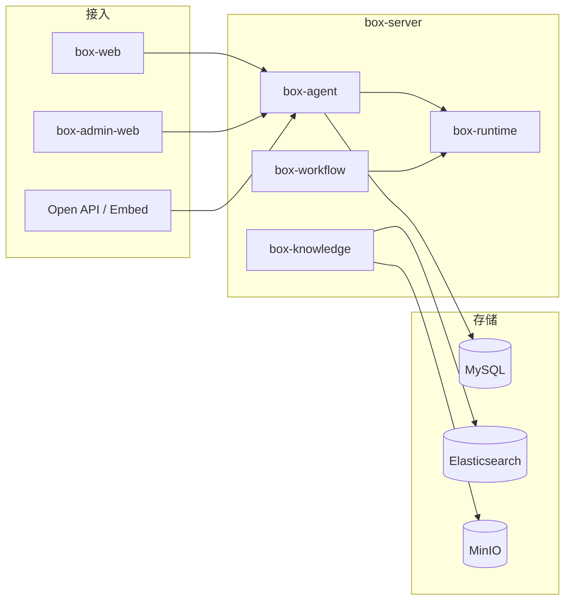

<p align="center">
  
</p>

<p align="center">
  <a href="./README_en.md">English</a> | 简体中文
</p>

<p align="center">
  <strong>Box</strong> 是企业级 <strong>AI Agent / Workflow</strong> 开发与运行平台。<br/>
  在统一工作空间内完成智能体配置、知识增强（RAG）、工具接入、流程编排、调试追踪与生产发布。
</p>

<p align="center">
  
  
  
  
  
  
</p>

<p align="center">
  
</p>

---

## 🎉 特性

- **Agent 全生命周期**：草稿编辑、版本快照、发布上线；生产环境仅运行 **Published Version**
- **双运行时**：`box-agent` 负责对话（SSE 流式）；`box-runtime` 负责 Workflow 节点调度（Strategy + Registry）
- **企业级 RAG**：文档解析分块、Embedding、Elasticsearch 混合检索与引用溯源
- **统一工具层**：HTTP / Database / Function / MCP 统一为 `AgentTool` 抽象
- **多租户与治理**：工作空间 RBAC、套餐额度、审计日志、执行链路 Trace
- **多种交付形态**：Web 工作台、管理控制台、Open API（API Key）、Embed 嵌入、[`box-sdk`](box-sdk/README.md)

V1 采用 **模块化单体**（Modular Monolith）：领域模块边界清晰，可按模块演进为微服务；暂不引入 Kafka / Kubernetes。

---

## 📦 安装与运行

**环境要求**：JDK 21、Maven 3.9+、Node.js 20+、Docker

```bash
# 基础设施：MySQL / Redis / Elasticsearch / MinIO
cd deploy && docker compose up -d

# 后端（8080）
cp box-server/box-bootstrap/src/main/resources/application.yml.example \
   box-server/box-bootstrap/src/main/resources/application.yml
cd box-server && mvn spring-boot:run -pl box-bootstrap
```

```bash
# C 端（5173，/api 代理至后端）
cd box-web && npm install && npm run dev

# 管理端（5174）
cd box-admin-web && npm install && npm run dev
```

**Docker 全栈**（含 `box-server` 镜像）：

```bash
cd deploy && docker compose --profile app up -d --build
```

| 组件 | 地址 |
|------|------|
| C 端 Web | http://localhost:5173 |
| 管理端 Web | http://localhost:5174 |
| REST API | http://localhost:8080/api/v1 |
| MySQL | `localhost:3307`，库名 `box` |
| MinIO Console | http://localhost:9001 |

配置说明见 [`application.yml.example`](box-server/box-bootstrap/src/main/resources/application.yml.example)。

---

## 🔨 快速体验

1. 启动中间件与 `box-server`、`box-web`（见上文）。
2. 浏览器打开 C 端，注册/登录后进入 **对话工作台**（`/chat`）。
3. 在 **Agent Builder** 中配置模型与 Prompt，调试通过后 **发布**，即可在对话或 Embed / API 中调用。

**流式对话 API**（需登录态或 API Key，已发布 Agent）：

```http
POST /api/v1/agents/{id}/chat
Content-Type: application/json

{ "message": "你好", "stream": true }
```

响应为 `text/event-stream`，事件类型包括 `delta`、`tool.*`、`citations`、`done` 等（详见 [架构文档 · SSE](docx/03-Architecture.md)）。

---

## 🏗 架构概览

前端多应用共用 `@box/ui`（TDesign Vue Next）；后端单进程承载领域模块，数据访问与中间件统一经 `box-infrastructure` 抽象。

<p align="center">
  
</p>



更完整的模块职责、数据模型与 API 约定见 **[架构设计](docx/03-Architecture.md)**、**[后端规范](docx/05-Backend.md)**。

### 配置与发布

<p align="center">
  
</p>

### RAG 知识管线

<p align="center">
  
</p>

### Workflow 执行

<p align="center">
  
</p>

---

## 📂 仓库说明

本仓库为 **Box AI** 单仓多工程结构，主要子工程如下：

| 目录 | 描述 |
|------|------|
| [`box-server`](box-server/) | 后端主工程，`com.boxai`，Spring Boot 3 + LangChain4j |
| [`box-web`](box-web/) | C 端：对话、Agent Builder、插件市场、设置 |
| [`box-admin-web`](box-admin-web/) | 平台管理：租户、套餐、模板、运营与审计 |
| [`box-ui`](box-ui/) | 共享 UI 与布局（`@box/ui`） |
| [`box-sdk`](box-sdk/) | 已发布 Agent 的 Open API 客户端（JS / Python） |
| [`deploy`](deploy/) | Docker Compose 开发与部署 |
| [`docx`](docx/) | 产品 PRD、架构、进度等设计文档 |

**`box-server` 领域模块（节选）**

| 模块 | 职责 |
|------|------|
| `box-agent` | Agent 管理 + **Agent 对话 Runtime**（`AgentChatExecutor`） |
| `box-runtime` | **Workflow 节点 Runtime**（`WorkflowExecutor`） |
| `box-knowledge` | 知识库、文档管线、检索 |
| `box-workflow` | 工作流定义与校验 |
| `box-tool` / `box-model` | 工具与模型 Provider |
| `box-conversation` | 会话与消息 |
| `box-publish` / `box-trace` / `box-analytics` | 发布、追踪、统计 |
| `box-user` / `box-workspace` / `box-tenant` | 身份、工作空间、多租户 |

---

## 🔌 开放集成

已发布 Agent 可通过 **API Key** 调用，详见 [`box-sdk/README.md`](box-sdk/README.md)。

```js
import { BoxClient } from '@box/sdk'

const box = new BoxClient({
  baseUrl: 'https://your-box-host',
  apiKey: 'ax_live_xxx',
})

await box.chat(agentId, '你好', {
  stream: true,
  onDelta: (chunk) => process.stdout.write(chunk),
})
```

---

## 📖 文档

| 文档 | 说明 |
|------|------|
| [架构设计](docx/03-Architecture.md) | 系统架构、Runtime、存储与 SSE |
| [后端规范](docx/05-Backend.md) | 包结构、API、编码约定 |
| [产品 PRD](docx/02-PRD.md) | 功能范围与优先级 |
| [进度追踪](docx/09-Progress.md) | V1 交付状态 |
| [待办缺口](docx/10-Gaps.md) | 未完成项与排期 |

---

## 命名约定

| 项 | 取值 |
|----|------|
| 产品名 | Box |
| 项目名 | Box AI |
| Java 包名 | `com.boxai` |
| 数据库 | `box` |
| Redis / ES 前缀 | `box:` |

---

<p align="center">
  <sub>Box AI · Enterprise Agent &amp; Workflow Platform</sub>
</p>

<!-- README 配图维护（改 SVG 后需重新导出 PNG，Gitee 用 PNG 避免挤压）：
python scripts/build_readme_hero.py && python scripts/build_readme_flow_svgs.py && python scripts/fix_readme_svg_dimensions.py
python scripts/export_readme_png.py
python -c "from PIL import Image; from pathlib import Path; r=Path('assets/readme'); s=Image.open('box-ui/src/assets/logo.png').convert('RGBA'); p=24; c=Image.new('RGBA',(s.width+2*p,s.height+2*p),(255,255,255,255)); c.paste(s,(p,p),s); c.save(r/'logo-readme.png')"
-->
