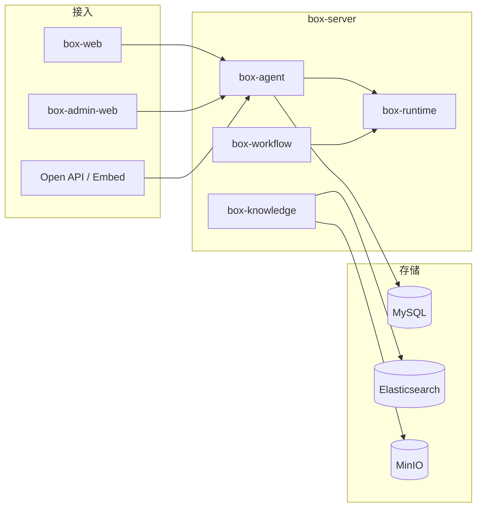

<p align="center">
  
</p>

<p align="center">
  <a href="./README_en.md">English</a> | 简体中文
</p>

<p align="center">
  <strong>Box</strong> 是企业级 <strong>AI Agent / Workflow</strong> 开发与运行平台。<br/>
  在统一工作空间内完成智能体配置、知识增强（RAG）、工具接入、流程编排、调试追踪与生产发布。
</p>

<p align="center">
  
  
  
  
  
  
</p>

<p align="center">
  
</p>

---

## 目录

- [为什么选择 Box](#为什么选择-box)
- [特性](#-特性)
- [产品能力全景](#产品能力全景)
- [技术栈](#技术栈)
- [安装与运行](#-安装与运行)
- [快速体验](#-快速体验)
- [架构概览](#-架构概览)
- [API 与 SSE 事件](#api-与-sse-事件)
- [仓库说明](#-仓库说明)
- [开放集成](#-开放集成)
- [设计原则](#设计原则)
- [路线图](#路线图)
- [参与贡献](#参与贡献)
- [文档](#-文档)

---

## 为什么选择 Box

Box 面向 **企业内部 AI 应用落地**，定位类似 Coze / Dify，但更强调：

| 维度 | Box 的做法 |
|------|------------|
| **交付形态** | 单仓多工程：C 端工作台 + B 端管理台 + Open API / Embed / SDK，可私有化部署 |
| **运行时** | Agent 对话与 Workflow 编排 **双 Runtime 分离**，职责清晰、便于演进 |
| **发布治理** | 草稿与已发布版本严格隔离，生产仅运行 **Published Version** |
| **企业能力** | 多租户、工作空间 RBAC、套餐额度、审计日志、全链路 Trace |
| **工程架构** | V1 采用 **模块化单体**（Modular Monolith），领域边界清晰，可按模块拆分为微服务 |

适合需要 **自建 Agent 平台**、对接内部系统、管控模型与数据出境的团队。完整产品范围见 [产品 PRD](docx/02-PRD.md)。

---

## 🎉 特性

### Agent 全生命周期

- 可视化 **Agent Builder**：模型、System Prompt、变量、知识库、工具绑定
- **版本快照** + **发布上线**：调试环境与生产环境配置隔离
- 支持 Web Chat、Embed 嵌入页、API Key 开放调用

### 双运行时引擎

| Runtime | 模块 | 职责 |
|---------|------|------|
| **Agent Chat** | `box-agent` · `AgentChatExecutor` | 多轮对话、RAG 检索、Tool Calling、SSE 流式输出 |
| **Workflow** | `box-runtime` · `WorkflowExecutor` | 图编排节点调度（Strategy + Registry），支持条件分支与循环 |

### 企业级 RAG

- 文档上传 → MinIO 原文件 → 解析分块 → Embedding → Elasticsearch 混合检索
- 对话流中推送 `citations` 事件，支持引用溯源

### 统一工具层

HTTP / Database / Function / **MCP** 统一抽象为 `AgentTool`，支持流式 Tool 事件（`tool.start` / `tool.delta` / `tool.end`）与危险操作确认。

### 多租户与治理

工作空间 RBAC、套餐与额度、操作审计、执行 Trace 与 Token 统计——满足平台化运营需求。

### 多种交付形态

[`box-web`](box-web/) 用户工作台 · [`box-admin-web`](box-admin-web/) 管理控制台 · Open API · Embed · [`box-sdk`](box-sdk/README.md)

> V1 采用模块化单体，暂不引入 Kafka / Kubernetes；详见 [架构设计](docx/03-Architecture.md)。

---

## 产品能力全景

<p align="center">
  
</p>

| 能力域 | C 端 `box-web` | B 端 `box-admin-web` | 开放集成 |
|--------|----------------|----------------------|----------|
| 对话工作台 | ✅ `/chat` 流式对话 | — | ✅ Published Agent API |
| Agent 配置 | ✅ Builder / 调试 | ✅ 模板与运营 | — |
| 知识库 RAG | ✅ 上传与管理 | ✅ 全局策略 | — |
| 工具 / MCP | ✅ 绑定与调试 | ✅ 平台级工具库 | — |
| Workflow | ✅ 可视化编排 | — | ✅ 作为 Agent 子能力 |
| 租户与用户 | ✅ 工作空间成员 | ✅ 租户 / 套餐 / 审计 | — |
| 嵌入站点 | ✅ Embed 配置 | — | ✅ iframe / SDK |

> 产品界面截图将在后续版本补充；当前以架构与流程图说明能力边界。

---

## 技术栈

| 层级 | 技术选型 |
|------|----------|
| 后端语言 | Java 21 |
| 后端框架 | Spring Boot 3.4、Spring Security |
| AI 编排 | LangChain4j 1.x |
| 前端框架 | Vue 3 + Vite + TypeScript |
| UI 组件库 | TDesign Vue Next（`@box/ui` 共享） |
| 关系库 | MySQL 8（库名 `box`） |
| 缓存 | Redis（前缀 `box:`） |
| 检索 / 向量 | Elasticsearch |
| 对象存储 | MinIO |
| 部署 | Docker Compose（[`deploy`](deploy/)） |

---

## 📦 安装与运行

**环境要求**：JDK 21、Maven 3.9+、Node.js 20+、Docker

```bash
# 1. 基础设施：MySQL / Redis / Elasticsearch / MinIO
cd deploy && docker compose up -d

# 2. 后端配置与启动（8080）
cp box-server/box-bootstrap/src/main/resources/application.yml.example \
   box-server/box-bootstrap/src/main/resources/application.yml
# 按需修改数据库、Redis、ES、MinIO 连接信息
cd box-server && mvn spring-boot:run -pl box-bootstrap
```

```bash
# 3. C 端（5173，/api 代理至后端）
cd box-web && npm install && npm run dev

# 4. 管理端（5174）
cd box-admin-web && npm install && npm run dev
```

**Docker 全栈**（含 `box-server` 镜像）：

```bash
cd deploy && docker compose --profile app up -d --build
```

| 组件 | 地址 |
|------|------|
| C 端 Web | http://localhost:5173 |
| 管理端 Web | http://localhost:5174 |
| REST API | http://localhost:8080/api/v1 |
| MySQL | `localhost:3307`，库名 `box` |
| MinIO Console | http://localhost:9001 |

配置说明见 [`application.yml.example`](box-server/box-bootstrap/src/main/resources/application.yml.example)。

**常见问题**

- 后端启动失败：确认 Docker 中间件已就绪，且 `application.yml` 中端口与 `deploy/docker-compose.yml` 一致。
- 前端 401：先完成注册/登录；开放 API 调用需使用 API Key（见下文）。
- Gitee 上图被挤压：README 配图使用 PNG，`` 仅设 `width`、不设 `height`。

---

## 🔨 快速体验

### 控制台路径

1. 启动中间件与 `box-server`、`box-web`（见上文）。
2. 浏览器打开 C 端，注册/登录后进入 **对话工作台**（`/chat`）。
3. 在 **Agent Builder** 中配置模型与 Prompt，绑定知识库或工具后 **调试**。
4. **发布** Agent 后，即可在对话、Embed 或 Open API 中调用已发布版本。

### 流式对话 API

**端点**（需登录态 JWT 或 API Key；Agent 须已发布）：

```http
POST /api/v1/agents/{id}/chat
Authorization: Bearer <token>   # 或 X-API-Key: ax_live_xxx
Content-Type: application/json

{ "message": "你好", "stream": true }
```

**已发布 Agent 开放端点**（仅 API Key）：

```http
POST /api/v1/published/agents/{id}/chat
X-API-Key: ax_live_xxx
Content-Type: application/json

{ "message": "你好", "stream": true }
```

响应为 `text/event-stream`（`data: {json}\n\n`），事件类型见下一节。

---

## 🏗 架构概览

前端多应用共用 `@box/ui`（TDesign Vue Next）；后端单进程承载领域模块，数据访问与中间件统一经 `box-infrastructure` 抽象。

<p align="center">
  
</p>



更完整的模块职责、数据模型与 API 约定见 **[架构设计](docx/03-Architecture.md)**、**[后端规范](docx/05-Backend.md)**、**[Runtime 说明](docx/06-Runtime.md)**。

### Agent 对话时序（SSE）

<p align="center">
  
</p>

### 配置与发布

<p align="center">
  
</p>

### RAG 知识管线

<p align="center">
  
</p>

### Workflow 执行

<p align="center">
  
</p>

---

## API 与 SSE 事件

**REST 前缀**：`/api/v1` · 鉴权：JWT（控制台）或 `X-API-Key`（开放调用）

| 资源 | 方法 | 路径（节选） | 说明 |
|------|------|--------------|------|
| Agent | CRUD | `/agents` | 含版本、发布、工具/知识库绑定 |
| 对话 | POST | `/agents/{id}/chat` | SSE 流式对话 |
| 已发布 | POST | `/published/agents/{id}/chat` | API Key 专用 |
| 知识库 | CRUD | `/knowledge-bases` | 文档上传与检索 |
| Workflow | CRUD | `/workflows` | 图定义与校验 |
| 会话 | CRUD | `/conversations` | 历史消息 |

**SSE 事件**（`ChatStreamEvent`，实现类 `AgentChatExecutor`）：

| type | 说明 |
|------|------|
| `citations` | RAG 引用列表（流开始前） |
| `delta` | 模型回答文本增量 |
| `tool.start` / `tool.delta` / `tool.end` | 工具调用生命周期 |
| `tool.confirm` | 危险工具需用户确认（可选） |
| `done` | 流结束，含 `executionId` |
| `error` | 错误信息 |

示例：

```json
{"type":"delta","content":"你好"}
{"type":"done","executionId":12345}
```

前端解析参考 `box-web/src/api/chatStream.ts`；完整字段见 [Runtime 文档 · SSE](docx/06-Runtime.md)。

---

## 📂 仓库说明

本仓库为 **Box AI** 单仓多工程结构，主要子工程如下：

| 目录 | 描述 |
|------|------|
| [`box-server`](box-server/) | 后端主工程，`com.boxai`，Spring Boot 3 + LangChain4j |
| [`box-web`](box-web/) | C 端：对话、Agent Builder、插件市场、设置 |
| [`box-admin-web`](box-admin-web/) | 平台管理：租户、套餐、模板、运营与审计 |
| [`box-ui`](box-ui/) | 共享 UI 与布局（`@box/ui`） |
| [`box-sdk`](box-sdk/) | 已发布 Agent 的 Open API 客户端（JS / Python） |
| [`deploy`](deploy/) | Docker Compose 开发与部署 |
| [`docx`](docx/) | 产品 PRD、架构、进度等设计文档 |

**`box-server` 领域模块（节选）**

| 模块 | 职责 |
|------|------|
| `box-agent` | Agent 管理 + **Agent 对话 Runtime**（`AgentChatExecutor`） |
| `box-runtime` | **Workflow 节点 Runtime**（`WorkflowExecutor`） |
| `box-knowledge` | 知识库、文档管线、检索 |
| `box-workflow` | 工作流定义与校验 |
| `box-tool` / `box-model` | 工具与模型 Provider |
| `box-conversation` | 会话与消息 |
| `box-publish` / `box-trace` / `box-analytics` | 发布、追踪、统计 |
| `box-user` / `box-workspace` / `box-tenant` | 身份、工作空间、多租户 |

---

## 🔌 开放集成

已发布 Agent 可通过 **API Key** 调用，详见 [`box-sdk/README.md`](box-sdk/README.md)。

```js
import { BoxClient } from '@box/sdk'

const box = new BoxClient({
  baseUrl: 'https://your-box-host',
  apiKey: 'ax_live_xxx',
})

await box.chat(agentId, '你好', {
  stream: true,
  onDelta: (chunk) => process.stdout.write(chunk),
})
```

**Embed**：在 Agent 发布配置中开启嵌入，将生成的 iframe 代码嵌入业务站点即可。

---

## 设计原则

1. **配置与运行分离** — Workflow 图定义与 `WorkflowExecutor` 执行解耦；Agent 草稿与 Published Version 隔离。
2. **领域模块化** — `box-modules/box-*` 按业务能力拆分，通过 `box-domain` 与 `box-application` 编排。
3. **基础设施下沉** — MySQL / Redis / ES / MinIO 访问统一经 `box-infrastructure`，避免模块直连 SDK。
4. **可观测优先** — 每次对话与工作流执行落库 Message、Trace Span、Token 用量。
5. **开放可集成** — 同一套 Runtime 服务控制台、Embed 与 Open API，不重复实现业务逻辑。

---

## 路线图

| 阶段 | 范围 | 状态 |
|------|------|------|
| **V1 P0** | Agent / RAG / Tool / Workflow / Publish / API Key / RBAC / Trace | 进行中，见 [进度追踪](docx/09-Progress.md) |
| **V1 P1** | MCP 深化、长期记忆、多 Agent、Webhook、插件市场 | 规划，见 [待办缺口](docx/10-Gaps.md) |
| **V2** | 计费配额、企业 SSO、分布式 Runtime、K8s 部署 | 远期 |

---

## 参与贡献

欢迎 Issue 与 Pull Request。提交前建议：

1. 阅读 [后端规范](docx/05-Backend.md) 与 [架构设计](docx/03-Architecture.md)。
2. 后端改动在 `box-server` 下按模块提交；前端遵循 TDesign + `@box/ui` 约定。
3. 涉及 API 或 SSE 协议变更时，同步更新 `docx/` 与本文档。

---

## 📖 文档

| 文档 | 说明 |
|------|------|
| [架构设计](docx/03-Architecture.md) | 系统架构、Runtime、存储与 SSE |
| [Runtime 说明](docx/06-Runtime.md) | Agent / Workflow 执行、SSE 事件格式 |
| [后端规范](docx/05-Backend.md) | 包结构、API、编码约定 |
| [产品 PRD](docx/02-PRD.md) | 功能范围与优先级 |
| [进度追踪](docx/09-Progress.md) | V1 交付状态 |
| [待办缺口](docx/10-Gaps.md) | 未完成项与排期 |

---

## 命名约定

| 项 | 取值 |
|----|------|
| 产品名 | Box |
| 项目名 | Box AI |
| Java 包名 | `com.boxai` |
| 数据库 | `box` |
| Redis / ES 前缀 | `box:` |

---

<p align="center">
  <sub>Box AI · Enterprise Agent &amp; Workflow Platform</sub>
</p>

<!-- README 配图维护（改 SVG 后需重新导出 PNG，Gitee 用 PNG 避免挤压）：
python scripts/build_readme_hero.py
python scripts/build_readme_flow_svgs.py
python scripts/export_readme_png.py
python -c "from PIL import Image; from pathlib import Path; r=Path('assets/readme'); s=Image.open('box-ui/src/assets/logo.png').convert('RGBA'); p=24; c=Image.new('RGBA',(s.width+2*p,s.height+2*p),(255,255,255,255)); c.paste(s,(p,p),s); c.save(r/'logo-readme.png')"
-->
