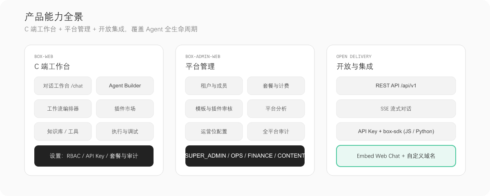
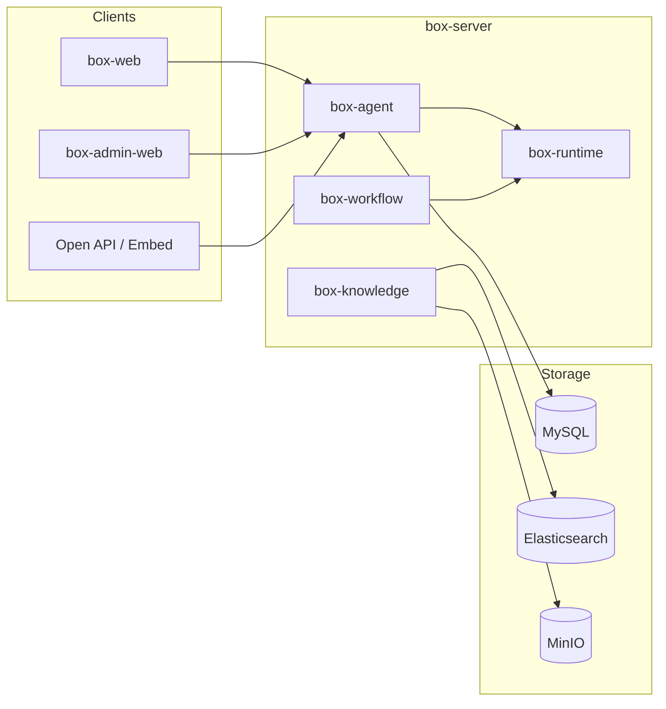
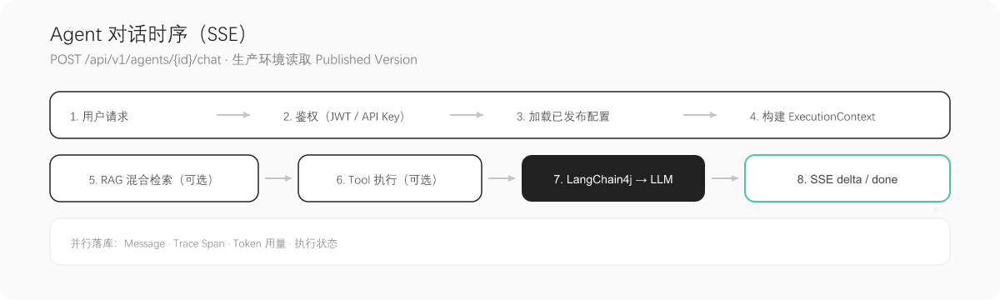

<p align="center">
  
</p>

<p align="center">
  English | <a href="./README.md">简体中文</a>
</p>

<p align="center">
  <strong>Box</strong> is an enterprise <strong>AI Agent / Workflow</strong> platform for building and operating intelligent applications.<br/>
  Configure agents, RAG, tools, and workflows in a unified workspace—from prototyping to production with tracing and governance.
</p>

<p align="center">
  
  
  
  
  
  
</p>

<p align="center">
  
</p>

---

## Table of contents

- [Why Box](#why-box)
- [Features](#-features)
- [Product capabilities](#product-capabilities)
- [Tech stack](#tech-stack)
- [Install & run](#-install--run)
- [Quick start](#-quick-start)
- [Architecture](#-architecture)
- [API & SSE events](#api--sse-events)
- [Repository layout](#-repository-layout)
- [Open integration](#-open-integration)
- [Design principles](#design-principles)
- [Roadmap](#roadmap)
- [Contributing](#contributing)
- [Documentation](#-documentation)

---

## Why Box

Box targets **enterprise AI application delivery**. It is comparable to Coze or Dify, with emphasis on:

| Dimension | Box approach |
|-----------|--------------|
| **Delivery** | Monorepo: user console + admin console + Open API / Embed / SDK; self-hosted friendly |
| **Runtime** | **Dual runtimes**: Agent chat vs Workflow orchestration, clearly separated |
| **Governance** | Draft vs published configs are isolated; production runs **Published Version** only |
| **Enterprise** | Multi-tenancy, workspace RBAC, plans & quotas, audit logs, full execution tracing |
| **Engineering** | V1 **modular monolith** with clear domain boundaries and a path to split services |

A good fit for teams that need a **self-hosted Agent platform** with internal system integration and data governance. See [PRD](docx/02-PRD.md) for full scope (Chinese).

---

## 🎉 Features

### Agent lifecycle

- Visual **Agent Builder**: model, system prompt, variables, knowledge bases, tools
- **Version snapshots** and **publish**; debug and production configs stay separate
- Web Chat, Embed pages, and API Key access for published agents

### Dual runtime engines

| Runtime | Module | Responsibility |
|---------|--------|----------------|
| **Agent Chat** | `box-agent` · `AgentChatExecutor` | Multi-turn chat, RAG, tool calling, SSE streaming |
| **Workflow** | `box-runtime` · `WorkflowExecutor` | Graph node scheduling (Strategy + Registry), branches and loops |

### Enterprise RAG

Upload → MinIO → parse & chunk → embed → Elasticsearch hybrid search; `citations` events in the chat stream for source attribution.

### Unified tools

HTTP / Database / Function / **MCP** behind the `AgentTool` abstraction; streaming tool events (`tool.start` / `tool.delta` / `tool.end`) and optional confirmation for risky tools.

### Multi-tenant governance

Workspace RBAC, plans & quotas, audit logs, execution traces, and token usage—for platform operations.

### Multiple channels

[`box-web`](box-web/) user app · [`box-admin-web`](box-admin-web/) admin console · Open API · Embed · [`box-sdk`](box-sdk/README.md)

> V1 is a modular monolith without Kafka or Kubernetes. See [Architecture](docx/03-Architecture.md).

---

## Product capabilities

<p align="center">
  
</p>

| Area | `box-web` (user) | `box-admin-web` (admin) | Open integration |
|------|------------------|-------------------------|------------------|
| Chat workspace | ✅ `/chat` streaming | — | ✅ Published Agent API |
| Agent config | ✅ Builder / debug | ✅ Templates & ops | — |
| Knowledge RAG | ✅ Upload & manage | ✅ Global policies | — |
| Tools / MCP | ✅ Bind & debug | ✅ Platform tool library | — |
| Workflow | ✅ Visual editor | — | ✅ As Agent sub-capability |
| Tenants & users | ✅ Workspace members | ✅ Tenants / plans / audit | — |
| Embed | ✅ Embed settings | — | ✅ iframe / SDK |

> Product screenshots will be added later; diagrams above describe capability boundaries for now.

---

## Tech stack

| Layer | Choices |
|-------|---------|
| Backend | Java 21, Spring Boot 3.4, Spring Security |
| AI orchestration | LangChain4j 1.x |
| Frontend | Vue 3, Vite, TypeScript |
| UI | TDesign Vue Next (shared `@box/ui`) |
| RDBMS | MySQL 8 (`box` database) |
| Cache | Redis (`box:` prefix) |
| Search / vectors | Elasticsearch |
| Object storage | MinIO |
| Deploy | Docker Compose ([`deploy`](deploy/)) |

---

## 📦 Install & Run

**Requirements**: JDK 21, Maven 3.9+, Node.js 20+, Docker

```bash
# 1. Infrastructure: MySQL / Redis / Elasticsearch / MinIO
cd deploy && docker compose up -d

# 2. Backend (port 8080)
cp box-server/box-bootstrap/src/main/resources/application.yml.example \
   box-server/box-bootstrap/src/main/resources/application.yml
cd box-server && mvn spring-boot:run -pl box-bootstrap
```

```bash
# 3. User web (5173, /api proxied to backend)
cd box-web && npm install && npm run dev

# 4. Admin console (5174)
cd box-admin-web && npm install && npm run dev
```

**Full stack in Docker** (includes `box-server` image):

```bash
cd deploy && docker compose --profile app up -d --build
```

| Component | URL |
|-----------|-----|
| User web | http://localhost:5173 |
| Admin web | http://localhost:5174 |
| REST API | http://localhost:8080/api/v1 |
| MySQL | `localhost:3307`, database `box` |
| MinIO Console | http://localhost:9001 |

See [`application.yml.example`](box-server/box-bootstrap/src/main/resources/application.yml.example) for configuration.

**Troubleshooting**

- Backend won't start: ensure Docker services are up and ports match `application.yml` and `deploy/docker-compose.yml`.
- Frontend 401: sign in first; Open API calls need an API Key (below).
- Squashed images on Gitee: README uses PNG assets; set `width` only on ``, not `height`.

---

## 🔨 Quick Start

### Console flow

1. Start infrastructure, `box-server`, and `box-web`.
2. Sign up or sign in, open the **chat workspace** (`/chat`).
3. Configure model and prompts in **Agent Builder**, bind knowledge or tools, and **debug**.
4. **Publish** the agent, then use chat, Embed, or Open API against the published version.

### Streaming chat API

**Endpoint** (JWT session or API Key; agent must be published):

```http
POST /api/v1/agents/{id}/chat
Authorization: Bearer <token>
Content-Type: application/json

{ "message": "Hello", "stream": true }
```

**Published agent endpoint** (API Key only):

```http
POST /api/v1/published/agents/{id}/chat
X-API-Key: ax_live_xxx
Content-Type: application/json

{ "message": "Hello", "stream": true }
```

Response is `text/event-stream` (`data: {json}\n\n`). Event types are listed below.

---

## 🏗 Architecture

Frontends share `@box/ui` (TDesign Vue Next). The backend runs as a single process with domain modules; data access and middleware go through `box-infrastructure`.

<p align="center">
  
</p>



See **[Architecture](docx/03-Architecture.md)**, **[Backend guide](docx/05-Backend.md)**, and **[Runtime](docx/06-Runtime.md)** (mostly Chinese) for details.

### Agent chat sequence (SSE)

<p align="center">
  
</p>

### Configure & publish

<p align="center">
  
</p>

### RAG pipeline

<p align="center">
  
</p>

### Workflow execution

<p align="center">
  
</p>

---

## API & SSE events

**REST prefix**: `/api/v1` · Auth: JWT (console) or `X-API-Key` (open calls)

| Resource | Method | Path (sample) | Notes |
|----------|--------|---------------|-------|
| Agent | CRUD | `/agents` | Versions, publish, tool/KB bindings |
| Chat | POST | `/agents/{id}/chat` | SSE streaming |
| Published | POST | `/published/agents/{id}/chat` | API Key only |
| Knowledge | CRUD | `/knowledge-bases` | Upload & search |
| Workflow | CRUD | `/workflows` | Graph definition |
| Conversation | CRUD | `/conversations` | Message history |

**SSE events** (`ChatStreamEvent`, `AgentChatExecutor`):

| type | Description |
|------|-------------|
| `citations` | RAG citation list (before answer stream) |
| `delta` | Model text chunk |
| `tool.start` / `tool.delta` / `tool.end` | Tool call lifecycle |
| `tool.confirm` | Risky tool needs user confirmation (optional) |
| `done` | Stream end with `executionId` |
| `error` | Error message |

Examples:

```json
{"type":"delta","content":"Hello"}
{"type":"done","executionId":12345}
```

Frontend parsing: `box-web/src/api/chatStream.ts`. Full schema: [Runtime · SSE](docx/06-Runtime.md).

---

## 📂 Repository layout

**Box AI** is a monorepo:

| Path | Description |
|------|-------------|
| [`box-server`](box-server/) | Backend (`com.boxai`), Spring Boot 3 + LangChain4j |
| [`box-web`](box-web/) | User app: chat, Agent Builder, plugin market, settings |
| [`box-admin-web`](box-admin-web/) | Platform admin: tenants, plans, templates, ops & audit |
| [`box-ui`](box-ui/) | Shared UI and layouts (`@box/ui`) |
| [`box-sdk`](box-sdk/) | Published Agent Open API clients (JS / Python) |
| [`deploy`](deploy/) | Docker Compose for dev and deployment |
| [`docx`](docx/) | PRD, architecture, progress notes (mostly Chinese) |

**`box-server` domain modules (selected)**

| Module | Role |
|--------|------|
| `box-agent` | Agent management + **chat runtime** (`AgentChatExecutor`) |
| `box-runtime` | **Workflow node runtime** (`WorkflowExecutor`) |
| `box-knowledge` | Knowledge bases, ingestion, search |
| `box-workflow` | Workflow definitions and validation |
| `box-tool` / `box-model` | Tools and model providers |
| `box-conversation` | Conversations and messages |
| `box-publish` / `box-trace` / `box-analytics` | Publish, tracing, analytics |
| `box-user` / `box-workspace` / `box-tenant` | Identity, workspaces, multi-tenancy |

---

## 🔌 Open integration

Call published agents with an **API Key**. Details: [`box-sdk/README.md`](box-sdk/README.md).

```js
import { BoxClient } from '@box/sdk'

const box = new BoxClient({
  baseUrl: 'https://your-box-host',
  apiKey: 'ax_live_xxx',
})

await box.chat(agentId, 'Hello', {
  stream: true,
  onDelta: (chunk) => process.stdout.write(chunk),
})
```

**Embed**: enable embed in publish settings and drop the iframe snippet into your site.

---

## Design principles

1. **Separate config from execution** — Workflow graphs vs `WorkflowExecutor`; agent drafts vs published versions.
2. **Domain modules** — `box-modules/box-*` by capability, orchestrated via `box-domain` / `box-application`.
3. **Infrastructure at the bottom** — MySQL / Redis / ES / MinIO only through `box-infrastructure`.
4. **Observable by default** — Every chat and workflow run records messages, trace spans, and token usage.
5. **One runtime, many channels** — Console, Embed, and Open API share the same execution path.

---

## Roadmap

| Phase | Scope | Status |
|-------|-------|--------|
| **V1 P0** | Agent / RAG / Tool / Workflow / Publish / API Key / RBAC / Trace | In progress — [Progress](docx/09-Progress.md) |
| **V1 P1** | MCP, long-term memory, multi-agent, webhook, marketplace | Planned — [Gaps](docx/10-Gaps.md) |
| **V2** | Billing, enterprise SSO, distributed runtime, K8s | Future |

---

## Contributing

Issues and pull requests are welcome. Before submitting:

1. Read [Backend guide](docx/05-Backend.md) and [Architecture](docx/03-Architecture.md).
2. Backend changes live under `box-server` by module; frontend follows TDesign + `@box/ui` conventions.
3. Update `docx/` and this README when changing APIs or SSE contracts.

---

## 📖 Documentation

| Document | Description |
|----------|-------------|
| [Architecture](docx/03-Architecture.md) | System design, runtime, storage, SSE |
| [Runtime](docx/06-Runtime.md) | Agent / workflow execution, SSE format |
| [Backend guide](docx/05-Backend.md) | Packages, APIs, conventions |
| [PRD](docx/02-PRD.md) | Scope and priorities |
| [Progress](docx/09-Progress.md) | V1 delivery status |
| [Gaps](docx/10-Gaps.md) | Open items and sequencing |

---

## Naming

| Item | Value |
|------|-------|
| Product | Box |
| Project | Box AI |
| Java package | `com.boxai` |
| Database | `box` |
| Redis / ES prefix | `box:` |

---

<p align="center">
  <sub>Box AI · Enterprise Agent &amp; Workflow Platform</sub>
</p>

<!-- README assets:
python scripts/build_readme_hero.py
python scripts/build_readme_flow_svgs.py
python scripts/export_readme_png.py
-->
