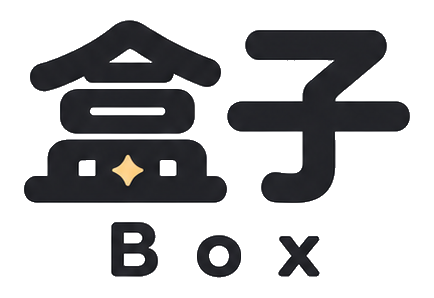
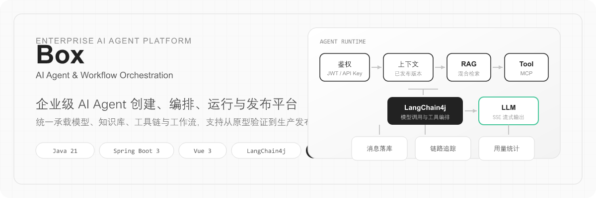
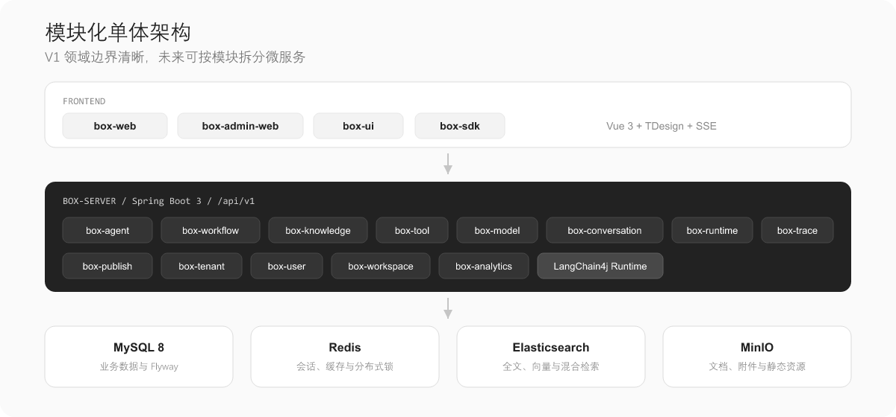
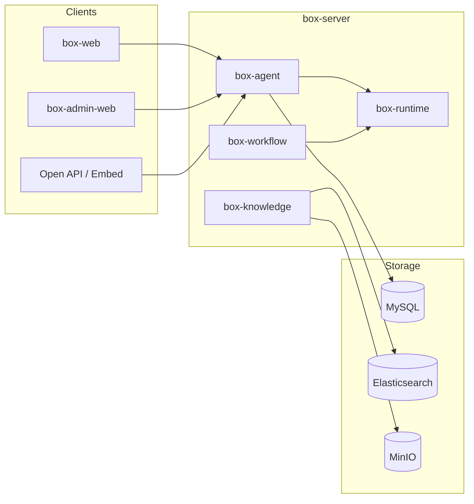
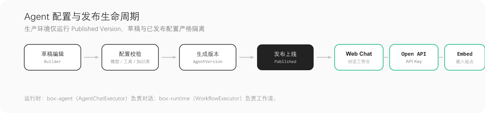
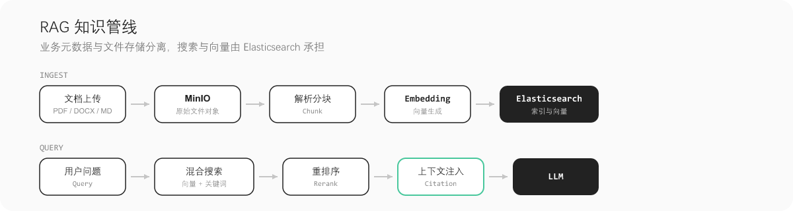
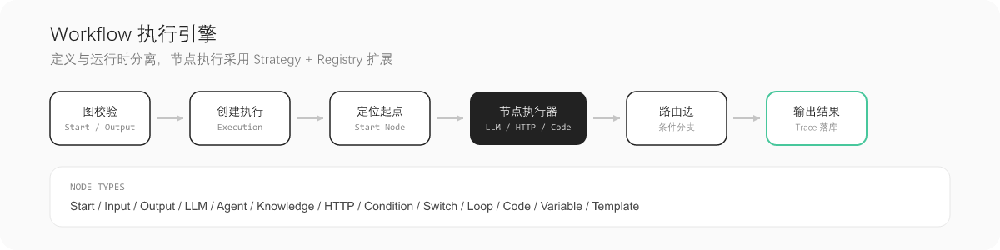

<p align="center">
  
</p>

<p align="center">
  English | <a href="./README.md">简体中文</a>
</p>

<p align="center">
  <strong>Box</strong> is an enterprise <strong>AI Agent / Workflow</strong> platform for building and operating intelligent applications.<br/>
  Configure agents, RAG, tools, and workflows in a unified workspace—from prototyping to production with tracing and governance.
</p>

<p align="center">
  
  
  
  
  
  
</p>

<p align="center">
  
</p>

---

## 🎉 Features

- **Agent lifecycle**: Draft editing, version snapshots, and publish; production runs **Published Version** only
- **Dual runtimes**: `box-agent` for chat (SSE streaming); `box-runtime` for workflow nodes (Strategy + Registry)
- **Enterprise RAG**: Parsing, chunking, embeddings, Elasticsearch hybrid search, and citations
- **Unified tools**: HTTP / Database / Function / MCP behind the `AgentTool` abstraction
- **Multi-tenant governance**: Workspace RBAC, plans & quotas, audit logs, execution tracing
- **Multiple delivery channels**: Web console, admin console, Open API (API Key), Embed, and [`box-sdk`](box-sdk/README.md)

V1 uses a **modular monolith**: clear domain boundaries with a path to split services later; no Kafka or Kubernetes in V1.

---

## 📦 Install & Run

**Requirements**: JDK 21, Maven 3.9+, Node.js 20+, Docker

```bash
# Infrastructure: MySQL / Redis / Elasticsearch / MinIO
cd deploy && docker compose up -d

# Backend (port 8080)
cp box-server/box-bootstrap/src/main/resources/application.yml.example \
   box-server/box-bootstrap/src/main/resources/application.yml
cd box-server && mvn spring-boot:run -pl box-bootstrap
```

```bash
# User web app (5173, /api proxied to backend)
cd box-web && npm install && npm run dev

# Admin console (5174)
cd box-admin-web && npm install && npm run dev
```

**Full stack in Docker** (includes `box-server` image):

```bash
cd deploy && docker compose --profile app up -d --build
```

| Component | URL |
|-----------|-----|
| User web | http://localhost:5173 |
| Admin web | http://localhost:5174 |
| REST API | http://localhost:8080/api/v1 |
| MySQL | `localhost:3307`, database `box` |
| MinIO Console | http://localhost:9001 |

See [`application.yml.example`](box-server/box-bootstrap/src/main/resources/application.yml.example) for configuration.

---

## 🔨 Quick Start

1. Start infrastructure, `box-server`, and `box-web` (see above).
2. Open the user web app, sign up or sign in, and go to the **chat workspace** (`/chat`).
3. Configure model and prompts in **Agent Builder**, debug, **publish**, then use chat, Embed, or API.

**Streaming chat API** (session or API Key; published agent):

```http
POST /api/v1/agents/{id}/chat
Content-Type: application/json

{ "message": "Hello", "stream": true }
```

Response is `text/event-stream` with events such as `delta`, `tool.*`, `citations`, and `done` (see [Architecture · SSE](docx/03-Architecture.md)).

---

## 🏗 Architecture

Frontends share `@box/ui` (TDesign Vue Next). The backend runs as a single process with domain modules; data access and middleware go through `box-infrastructure`.

<p align="center">
  
</p>



For module responsibilities, data models, and API conventions, see **[Architecture](docx/03-Architecture.md)** and **[Backend guide](docx/05-Backend.md)** (Chinese).

### Configure & publish

<p align="center">
  
</p>

### RAG pipeline

<p align="center">
  
</p>

### Workflow execution

<p align="center">
  
</p>

---

## 📂 Repository layout

**Box AI** is a monorepo. Main packages:

| Path | Description |
|------|-------------|
| [`box-server`](box-server/) | Backend (`com.boxai`), Spring Boot 3 + LangChain4j |
| [`box-web`](box-web/) | User app: chat, Agent Builder, plugin market, settings |
| [`box-admin-web`](box-admin-web/) | Platform admin: tenants, plans, templates, ops & audit |
| [`box-ui`](box-ui/) | Shared UI and layouts (`@box/ui`) |
| [`box-sdk`](box-sdk/) | Published Agent Open API clients (JS / Python) |
| [`deploy`](deploy/) | Docker Compose for dev and deployment |
| [`docx`](docx/) | PRD, architecture, progress notes (mostly Chinese) |

**`box-server` domain modules (selected)**

| Module | Role |
|--------|------|
| `box-agent` | Agent management + **chat runtime** (`AgentChatExecutor`) |
| `box-runtime` | **Workflow node runtime** (`WorkflowExecutor`) |
| `box-knowledge` | Knowledge bases, ingestion, search |
| `box-workflow` | Workflow definitions and validation |
| `box-tool` / `box-model` | Tools and model providers |
| `box-conversation` | Conversations and messages |
| `box-publish` / `box-trace` / `box-analytics` | Publish, tracing, analytics |
| `box-user` / `box-workspace` / `box-tenant` | Identity, workspaces, multi-tenancy |

---

## 🔌 Open integration

Call published agents with an **API Key**. Details: [`box-sdk/README.md`](box-sdk/README.md).

```js
import { BoxClient } from '@box/sdk'

const box = new BoxClient({
  baseUrl: 'https://your-box-host',
  apiKey: 'ax_live_xxx',
})

await box.chat(agentId, 'Hello', {
  stream: true,
  onDelta: (chunk) => process.stdout.write(chunk),
})
```

---

## 📖 Documentation

| Document | Description |
|----------|-------------|
| [Architecture](docx/03-Architecture.md) | System design, runtime, storage, SSE |
| [Backend guide](docx/05-Backend.md) | Packages, APIs, conventions |
| [PRD](docx/02-PRD.md) | Scope and priorities |
| [Progress](docx/09-Progress.md) | V1 delivery status |
| [Gaps](docx/10-Gaps.md) | Open items and sequencing |

---

## Naming

| Item | Value |
|------|-------|
| Product | Box |
| Project | Box AI |
| Java package | `com.boxai` |
| Database | `box` |
| Redis / ES prefix | `box:` |

---

<p align="center">
  <sub>Box AI · Enterprise Agent &amp; Workflow Platform</sub>
</p>

<!-- README assets: after updating the logo, run
cp box-ui/src/assets/logo.png assets/readme/logo.png
python scripts/build_readme_hero.py
python scripts/build_readme_flow_svgs.py
-->
