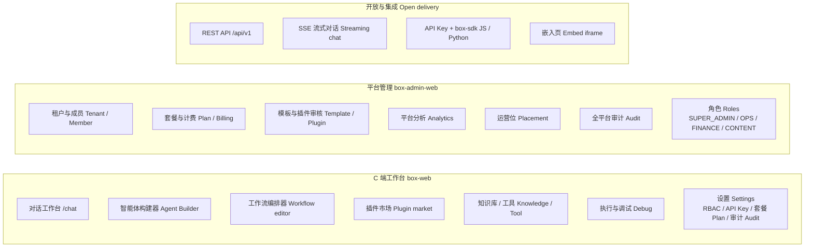

# 产品能力全景 Product map

矢量图：[`assets/flow-product.svg`](./assets/flow-product.svg)

```mermaid
flowchart LR
  subgraph C["C 端工作台 box-web"]
    C1["对话工作台 /chat"]
    C2["智能体构建器 Agent Builder"]
    C3["工作流编排器 Workflow editor"]
    C4["插件市场 Plugin market"]
    C5["知识库 / 工具 Knowledge / Tool"]
    C6["执行与调试 Debug"]
    C7["设置 Settings<br/>RBAC / API Key / 套餐 Plan / 审计 Audit"]
  end

  subgraph B["平台管理 box-admin-web"]
    B1["租户与成员 Tenant / Member"]
    B2["套餐与计费 Plan / Billing"]
    B3["模板与插件审核 Template / Plugin"]
    B4["平台分析 Analytics"]
    B5["运营位 Placement"]
    B6["全平台审计 Audit"]
    B7["角色 Roles<br/>SUPER_ADMIN / OPS / FINANCE / CONTENT"]
  end

  subgraph O["开放与集成 Open delivery"]
    O1["REST API /api/v1"]
    O2["SSE 流式对话 Streaming chat"]
    O3["API Key + box-sdk JS / Python"]
    O4["嵌入页 Embed iframe"]
  end
```
